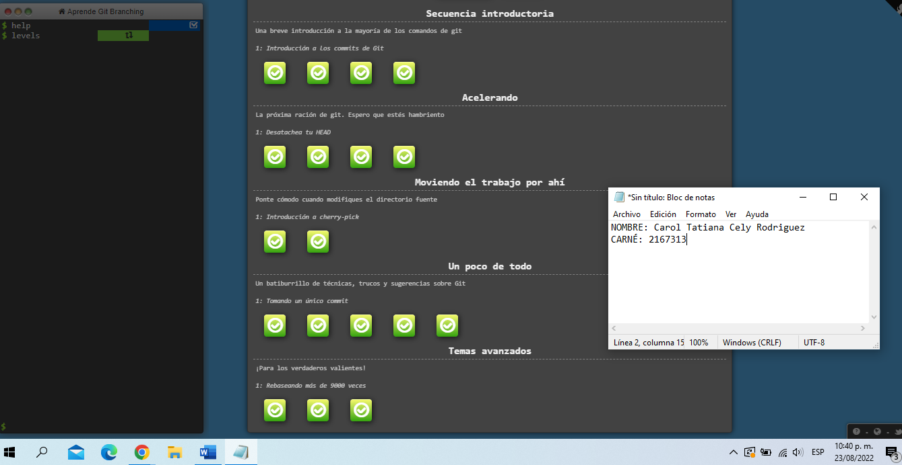
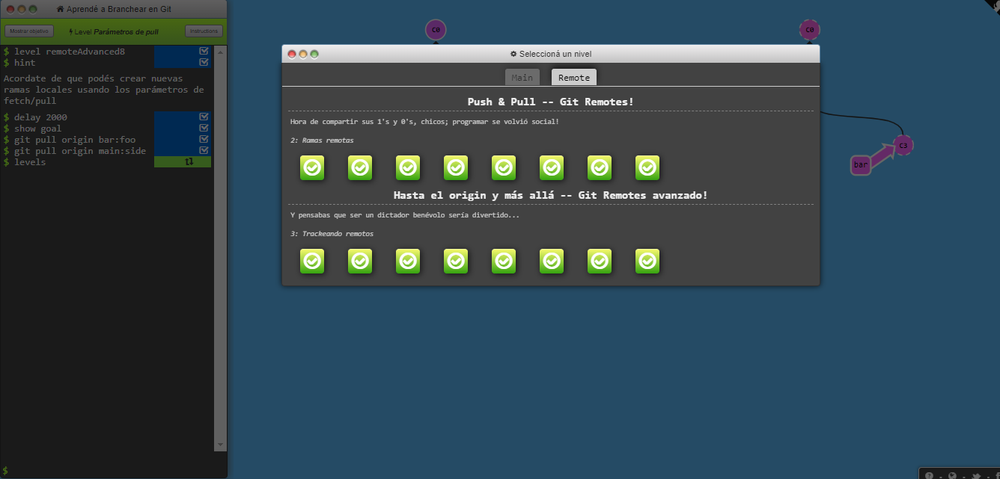

# Carol Tatiana Cely 
_Actualmente soy estudiante de ingeniería de sistemas en la Escuela Colombiana de Ingeniería Julio Garavito. Apasionada por escuchar música y las redes._

### Hobbies :blush:

* Escuchar música
* Salir con mi familia
* Ir a cine 

### Roles :computer:

* Desarrollador Front-end 
* QA

### Git Branching
_Seccion **_main_** de GitBranching_


_Seccion **_remote_** de GitBranching_


_Encuentra este sistema de aprendizaje en:_
[GitBranch](https://learngitbranching.js.org/?locale=es_AR) :memo:

Mi lenguaje favorito es el java
=

Haremos un print basiquito de java para recordarle al grupo como se hace

```
public class HolaMundo {
   public static void main(String[] args) {
     System.out.println("Hola mundo!");
   }
}
 ```
